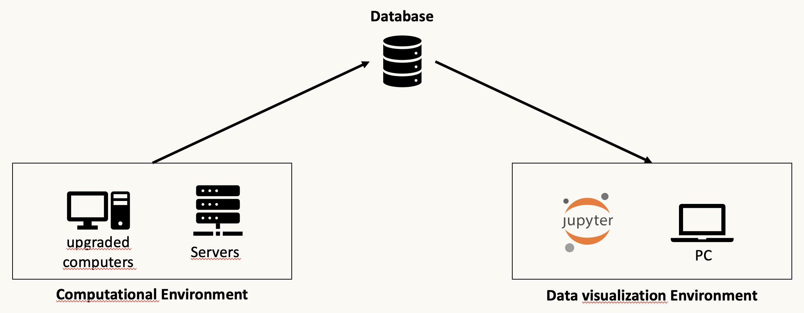

.. Automatic Computation Framework documentation master file, created by
   sphinx-quickstart on Sat Jun 19 11:03:17 2021.
   You can adapt this file completely to your liking, but it should at least
   contain the root `toctree` directive.

Computation Framework's documentation
===========================================================
This framework was born from a need emerged conducting research activity, expecialy running time/resource intensive
calculation that most of the time are perfomed on server/Cluster or HPC environment.
Some lucky researchers (like us) dispose of more than one environment and also data are collected by different people,
generally located in different places and working in different time.

For this reason we decided to desing and build a system capable to be used by different people enabling data collection
following the same rules and structures. We decided to design a tool that split the activities in three different pieces:

The first part designated to enable parallel calculation on 'computational environemnt' the second part is database,
for this framework we choose we provided facilities to connect the
`IBM Cloud cloudant database <https://cloud.ibm.com/catalog/services/cloudant>`_.
The third part consist on a plot class, on which data are retrieved from the database, postprocessed and plotted on yuor
own computer on a notebook on jupyter environment or on your own python script.

Data calculation
================
This part is dedicated, as introduced, to the intensive numerical calculation (real quantum devices or simulated on classical devices)
Usually this part is conducted on upgraded computers, HPC clusesters or quantum cloud devices. we experienced that some
simulated calculation need a huge amount of memory and execution time, for this reason we ran them on two different
upgraded servers, so we decided to develop this tool in order to keep our results organized and structured avoiding to
lose results or manually move files thourgh different environment.
Moreover with this kind of collection the obtained results are available once they are ready to the whole team who is
enabled to accede to the database, while results on the machine where they were produced are available also to the
people enabled to access on it.

Data collection
===============
We decided to collect all the obtained results on a **No-SQL json based database** beacause collect and serialize data on
a json is the easiest way on a python class. for this reason we defined on the constructor function of the metaclass
a json attribute named *final_json* to collect all the metadata of the performed run and all the results (raw and post
processed) and at the end of the calculation we pull this serialized json as a new record on the database.

.. warning::
   Remember to fill the ``final_json`` attribute with only
   `serializable elements <https://docs.python.org/3/library/json.html>`_ , otherwise the db saving will fail

Data Plot
=========
This last part is the framework component dedicated to retrieve data from the database and create plot and reports
in order to transform data to acquire the most effective communicative power.
In this framwork also this part has been written in python in order to be used in the jupyter environment to
post process resuls and graphical representation.

Considering that data are produced and stored near real time and that each plot is buil quering the database,
it allows to say that each plot is a live report of the obtained results, wherever they are produced.

.. toctree::
   :hidden:
   :caption: Contents:

   how_to_use
   code_description/index_code

.. toctree::
   :hidden:
   :caption: Use Cases

   use_cases/heisenberg

Indices and tables
==================

* :ref:`genindex`
* :ref:`modindex`
* :ref:`search`
